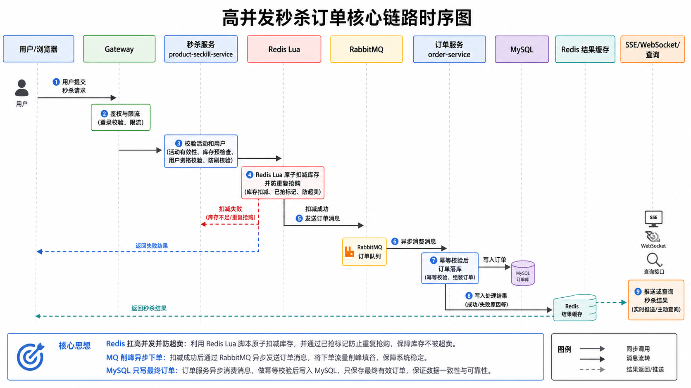
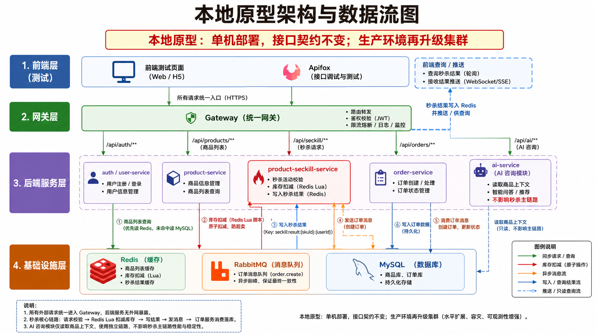
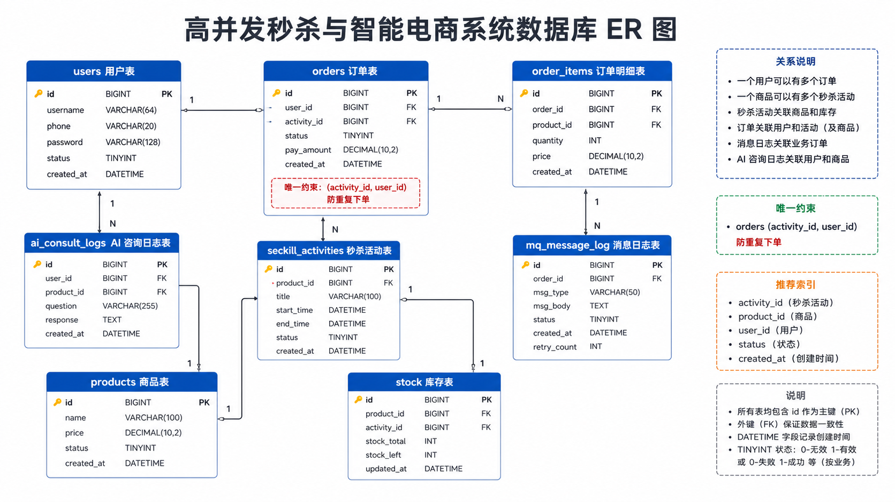
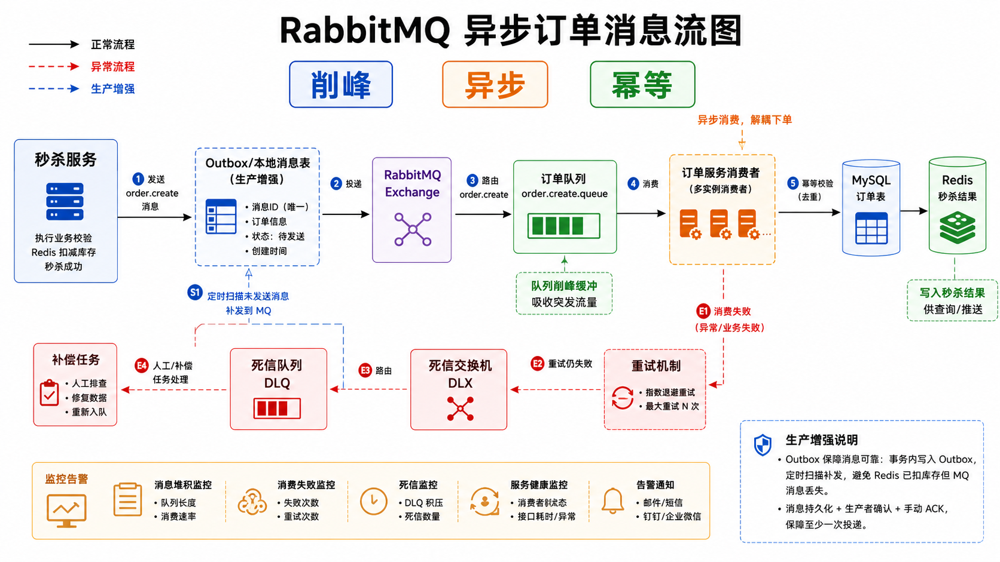
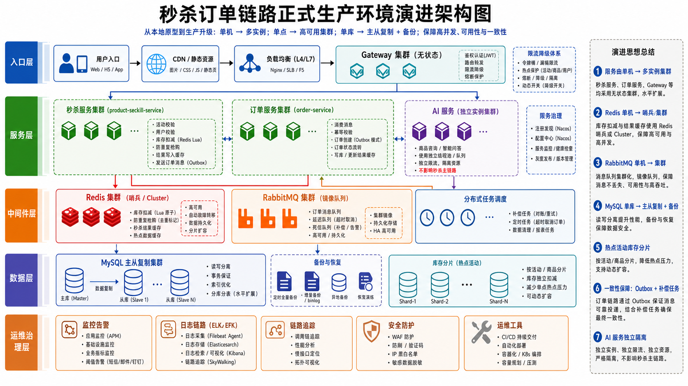
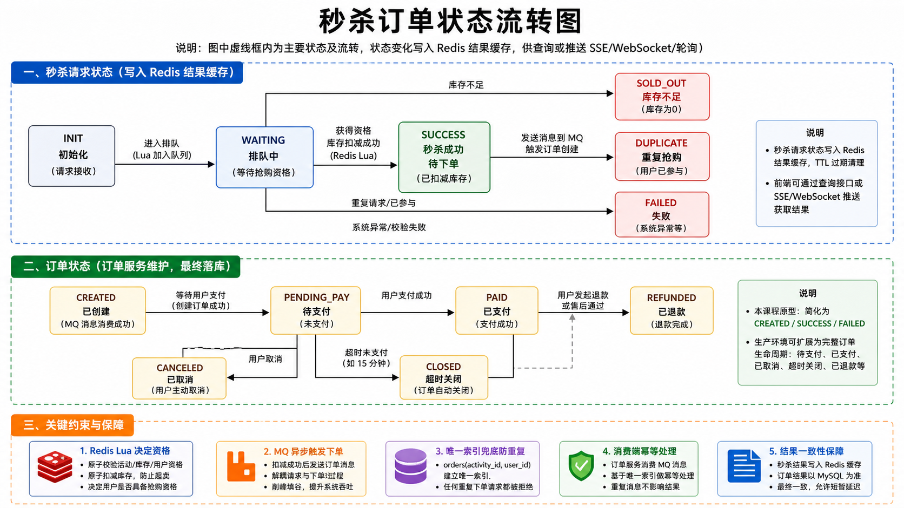

# 成员 B 报告素材

## 1. 文档用途

本文档汇总成员 B 当前可提前交付的报告素材。这里的图片均存放在 `docs/images/`，可直接嵌入最终报告、答辩材料或演示说明。

成员 B 负责的核心主题：

1. 高并发秒杀防超卖。
2. Redis 库存预热与 Lua 原子扣减。
3. RabbitMQ 异步订单削峰。
4. 订单服务幂等消费与 MySQL 落库。
5. 生产环境中 Redis、MQ、MySQL、秒杀服务和订单服务的演进。

## 2. 当前可用图片

### 2.1 秒杀核心链路时序图



说明：展示用户发起秒杀后，Gateway、秒杀服务、Redis、RabbitMQ、订单服务和 MySQL 的完整调用顺序。重点表达“秒杀接口返回 `QUEUEING` 不等于订单已创建”。

### 2.2 本地原型架构与数据流图



说明：展示本地原型中各服务和中间件的数据流向。Redis 保存库存、用户参与标记和秒杀结果；RabbitMQ 负责削峰；MySQL 保存最终事实。

### 2.3 数据库 ER 图



说明：展示商品、库存、秒杀活动、订单、订单明细和 MQ 日志之间的关系。`ai_consult_logs` 在数据库设计中为成员 C 可选扩展表，当前原型暂不持久化 AI 咨询日志。重点约束是 `orders(user_id, activity_id)` 和 `mq_message_logs.message_id`。

### 2.4 MQ 异步订单消息流图



说明：展示 `product-seckill-service` 如何把订单创建消息投递到 RabbitMQ，`order-service` 如何消费、幂等落库、ACK 或进入死信队列。

### 2.5 生产环境演进架构图



说明：展示本地原型如何演进为生产环境中的多实例服务、Redis Sentinel/Cluster、RabbitMQ 集群、MySQL 主从和监控告警。

### 2.6 订单状态流转图



说明：展示本项目重点状态 `QUEUEING -> CREATED / FAILED`，以及预留状态 `PAID`、`CANCELLED`。

## 3. 报告可复用文字

### 3.1 核心链路概括

本系统将秒杀请求拆分为“资格抢占”和“订单创建”两个阶段。前半段通过 Redis Lua 脚本完成库存原子扣减、防重复抢购和结果写入，保证 100 件库存、10000 并发请求下不超卖；后半段通过 RabbitMQ 将订单创建异步化，由订单服务幂等消费并写入 MySQL，从而削减数据库瞬时写入压力。

### 3.2 Redis 选型依据

秒杀库存是高频变化的热点数据，不适合直接由 MySQL 承担并发扣减。Redis 具备高性能读写能力，Lua 脚本可以把“检查活动、检查用户、检查库存、扣减库存、写入结果”合并成一次不可打断的原子操作，因此适合承担秒杀资格抢占阶段。

### 3.3 RabbitMQ 选型依据

订单创建需要写入数据库，处理速度远慢于 Redis 扣减。如果秒杀接口同步创建订单，数据库会承受瞬时写入洪峰。RabbitMQ 可以将抢到资格的请求排队，由订单服务按照自身处理能力逐步消费，实现异步削峰。

### 3.4 幂等设计依据

MQ 消息可能重复投递，因此订单服务必须保证同一消息或同一业务事件多次执行时只创建一笔订单。本项目通过 `messageId`、`orderNo`、`userId + activityId` 三层约束保证幂等。

### 3.5 生产环境演进概括

生产环境中，秒杀服务和订单服务应保持无状态并多实例部署；Redis 从单机演进到 Sentinel 或 Cluster；RabbitMQ 从单机演进到集群并启用持久化、确认机制和死信队列；MySQL 采用主从复制、读写分离和定期备份。对于 Redis 扣减成功但 MQ 暂不可用的场景，生产环境应引入 Outbox 本地消息表和补偿任务。

## 4. 后续待补充证据

以下内容需要等代码实现后补充：

```text
[ ] Swagger/OpenAPI 截图或导出文件
[ ] Apifox 可执行集合截图
[ ] Redis 库存扣减截图
[ ] RabbitMQ 队列消息截图
[ ] MySQL 订单落库截图
[ ] 100 件库存、10000 并发压测结果
[ ] 演示视频中的成员 B 讲解片段
```
