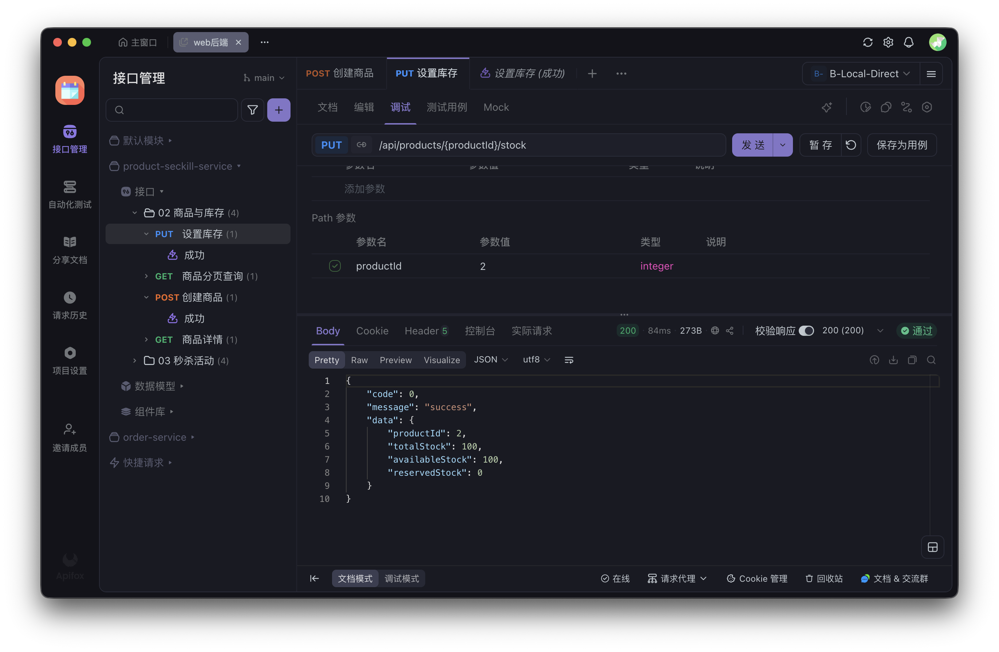
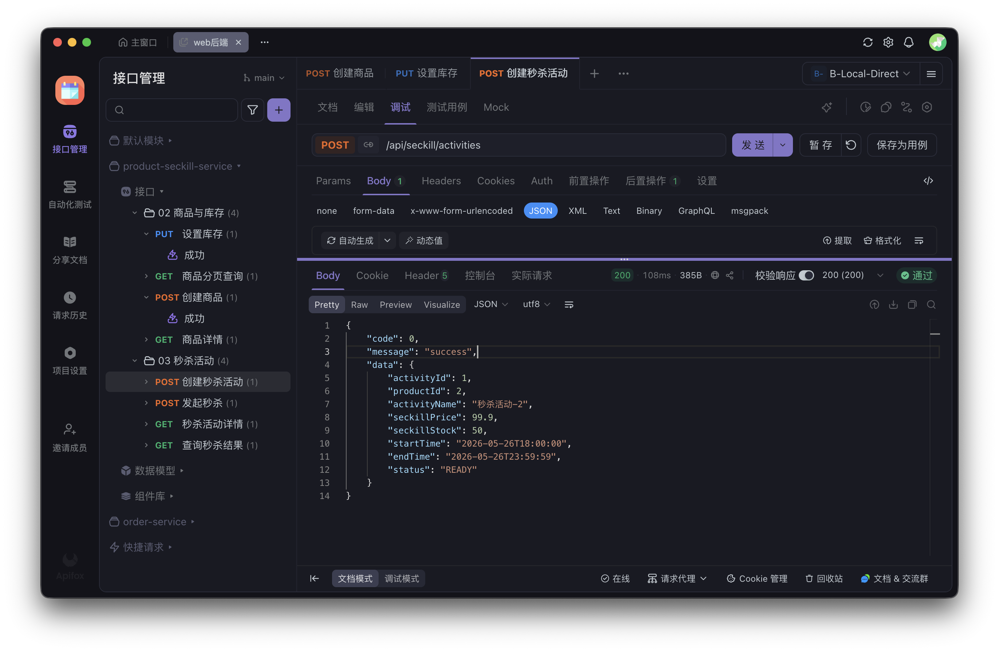
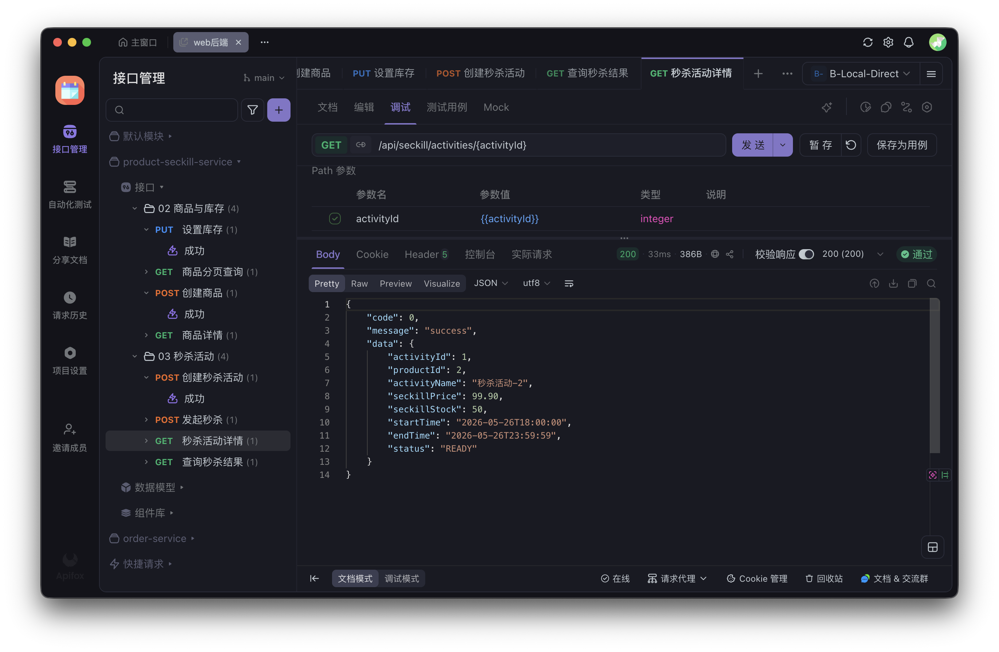
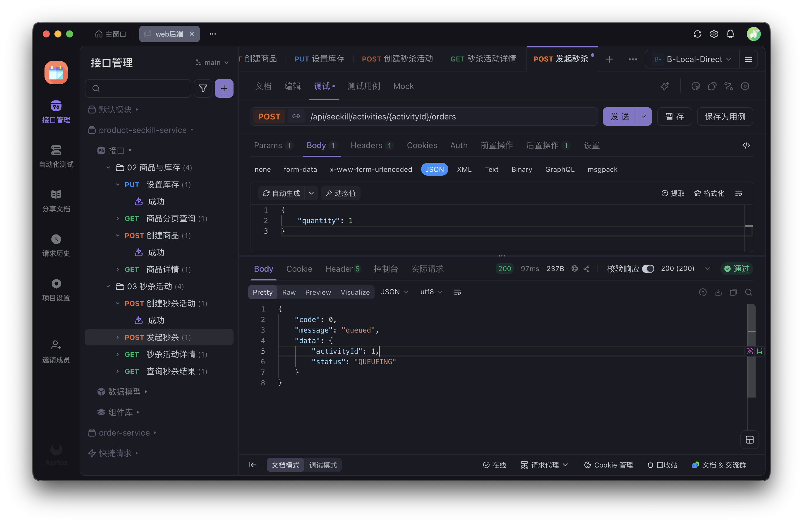
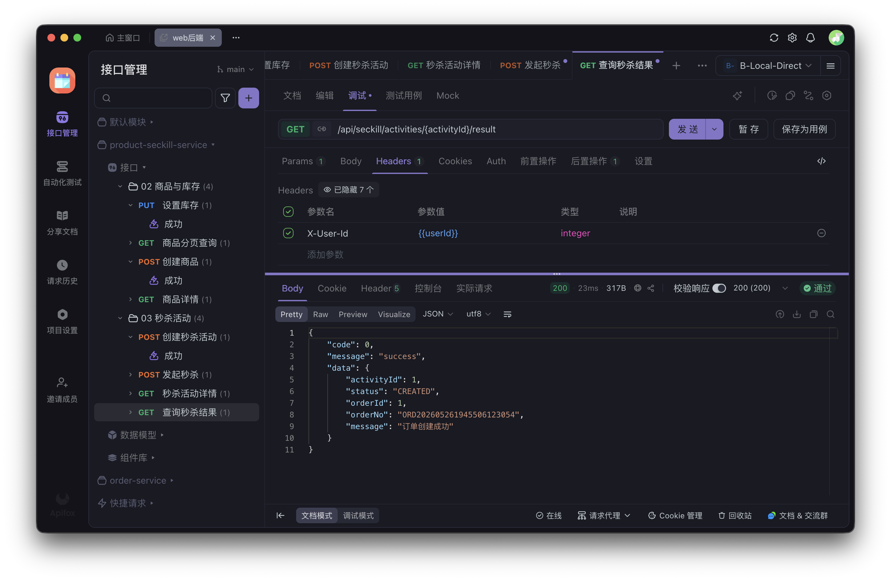
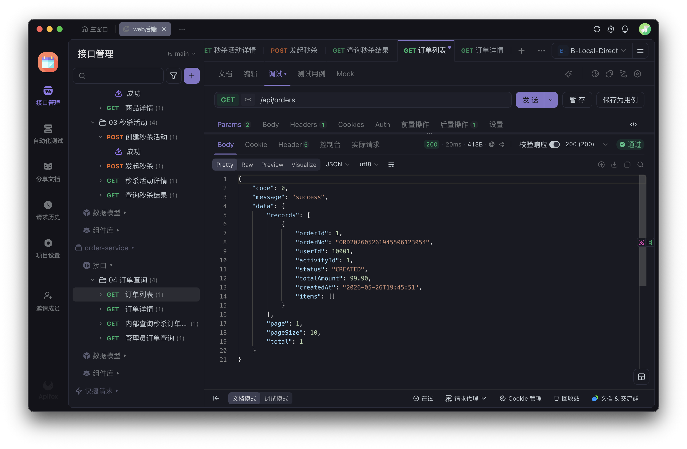
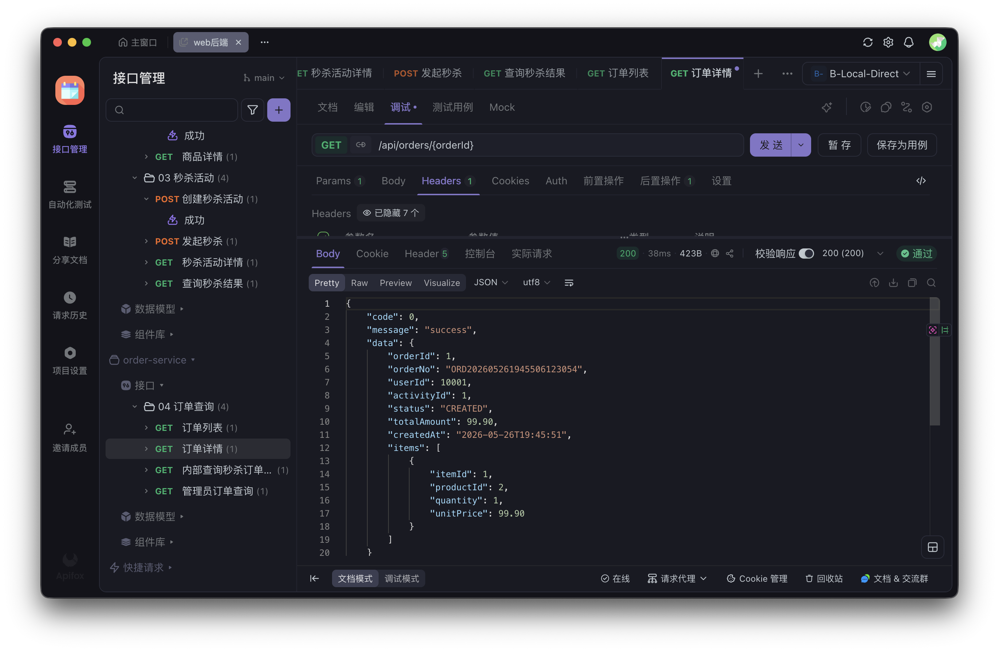
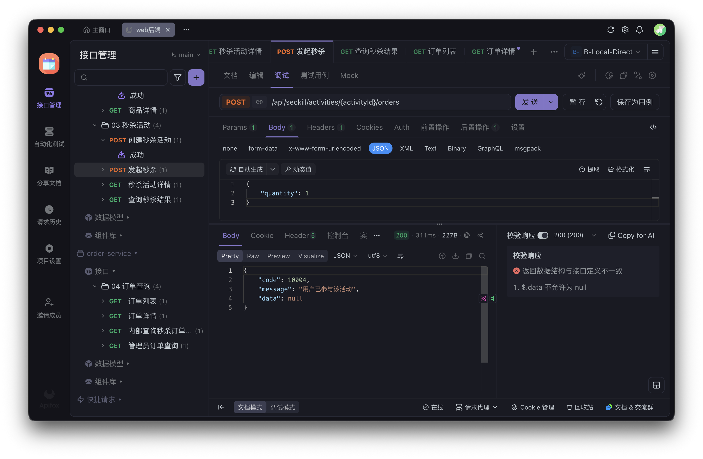
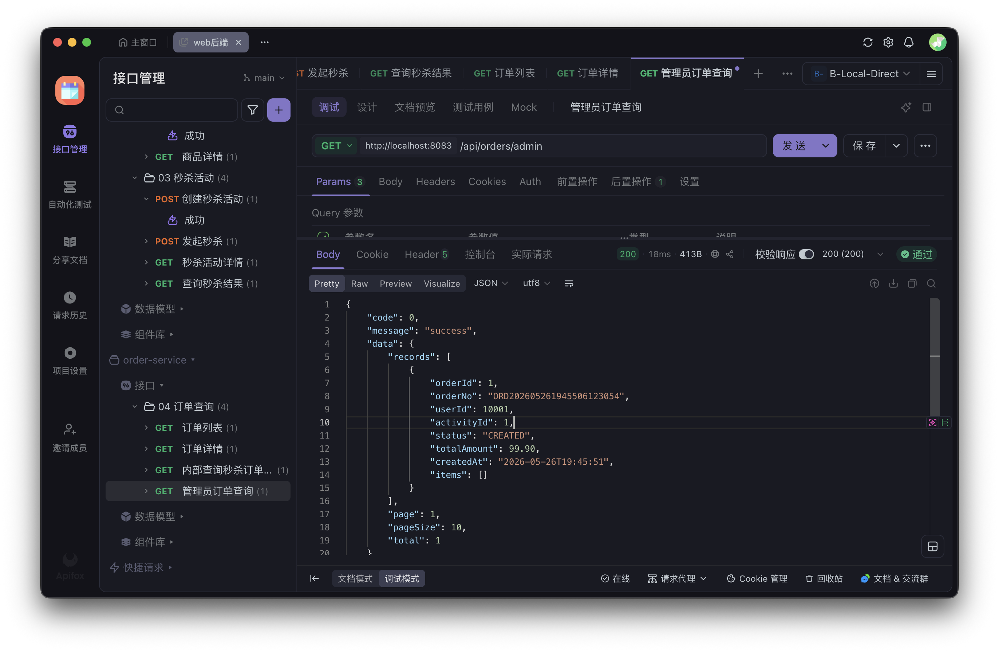

# 成员 B 阶段测试报告

## 1. 测试目标

验证成员 B 负责的商品、库存、秒杀、Redis、RabbitMQ、订单落库和结果查询链路。

本轮重点覆盖：

1. 秒杀活动创建后 Redis 库存预热成功。
2. 秒杀活动创建时会预占商品库存。
3. 秒杀请求通过 Redis Lua 原子扣减，防止超卖。
4. 秒杀成功后消息进入 RabbitMQ。
5. `order-service` 消费消息并写入 MySQL。
6. 订单创建成功后 Redis result 从 `QUEUEING` 变为 `CREATED`。
7. 同一用户重复抢购被拦截。
8. 并发场景下订单数不超过活动库存。

## 2. 测试环境

测试时间：2026-05-26 18:30 左右

本机 3306/6379 已被其他容器占用，因此本轮真实联调使用独立测试端口，避免影响其他项目数据。

| 组件 | 地址或容器 |
| --- | --- |
| product-seckill-service | `http://localhost:8082` |
| order-service | `http://localhost:8083` |
| MySQL | `localhost:3307/bupt_ecommerce`，容器 `bupt-ecommerce-mysql-3307` |
| Redis | `localhost:6380`，容器 `bupt-ecommerce-redis-6380` |
| RabbitMQ | `localhost:5672`，容器 `bupt-ecommerce-rabbitmq` |
| RabbitMQ 管理台 | `http://localhost:15672` |

服务启动时覆盖了默认配置：

```bash
SPRING_DATASOURCE_URL='jdbc:mysql://localhost:3307/bupt_ecommerce?useSSL=false&allowPublicKeyRetrieval=true&serverTimezone=Asia/Shanghai&characterEncoding=utf8' \
SPRING_DATA_REDIS_PORT=6380 \
mvn -f product-seckill-service/pom.xml spring-boot:run

SPRING_DATASOURCE_URL='jdbc:mysql://localhost:3307/bupt_ecommerce?useSSL=false&allowPublicKeyRetrieval=true&serverTimezone=Asia/Shanghai&characterEncoding=utf8' \
SPRING_DATA_REDIS_PORT=6380 \
mvn -f order-service/pom.xml spring-boot:run
```

健康检查结果：

```text
GET http://localhost:8082/actuator/health -> {"status":"UP"}
GET http://localhost:8083/actuator/health -> {"status":"UP"}
```

编译验证：

```text
mvn -pl product-seckill-service,order-service -am test -DskipTests
结果：BUILD SUCCESS
```

## 3. 主链路测试

### 3.1 创建商品

请求：

```bash
curl -s -X POST http://localhost:8082/api/products \
  -H 'Content-Type: application/json' \
  -H 'X-User-Id: 1' \
  -d '{"name":"demo phone","price":6999,"description":"B member seckill test product"}'
```

响应：

```json
{"code":0,"message":"success","data":{"productId":1,"name":"demo phone","description":"B member seckill test product","price":6999,"status":"ON_SALE","stock":null}}
```

### 3.2 设置库存

请求：

```bash
curl -s -X PUT http://localhost:8082/api/products/1/stock \
  -H 'Content-Type: application/json' \
  -d '{"stock":100}'
```

响应：

```json
{"code":0,"message":"success","data":{"productId":1,"totalStock":100,"availableStock":100,"reservedStock":0}}
```

### 3.3 创建秒杀活动并验证库存预占

请求：

```bash
curl -s -X POST http://localhost:8082/api/seckill/activities \
  -H 'Content-Type: application/json' \
  -d '{"productId":1,"startTime":"2026-05-26T18:00:00","endTime":"2026-05-26T23:59:59","seckillPrice":99.9,"seckillStock":50}'
```

响应：

```json
{"code":0,"message":"success","data":{"activityId":1,"productId":1,"activityName":"秒杀活动-1","seckillPrice":99.9,"seckillStock":50,"startTime":"2026-05-26T18:00:00","endTime":"2026-05-26T23:59:59","status":"READY"}}
```

Redis 证据：

```text
redis-cli GET seckill:stock:1 -> 50
```

MySQL 证据：

```sql
SELECT product_id,total_stock,available_stock,reserved_stock FROM product_stocks;
```

```text
product_id  total_stock  available_stock  reserved_stock
1           100          50               50
```

结论：活动创建后，50 件库存已进入秒杀活动预占库存，普通可用库存从 100 变为 50。

### 3.4 发起秒杀并验证 MQ 落单

请求：

```bash
curl -s -X POST http://localhost:8082/api/seckill/activities/1/orders \
  -H 'Content-Type: application/json' \
  -H 'X-User-Id: 10001' \
  -d '{"quantity":1}'
```

响应：

```json
{"code":0,"message":"queued","data":{"activityId":1,"status":"QUEUEING"}}
```

等待 MQ 消费后查询结果：

```bash
curl -s http://localhost:8082/api/seckill/activities/1/result \
  -H 'X-User-Id: 10001'
```

响应：

```json
{"code":0,"message":"success","data":{"activityId":1,"status":"CREATED","orderId":1,"orderNo":"ORD202605261832539546610","message":"订单创建成功"}}
```

Redis 证据：

```text
redis-cli GET seckill:stock:1 -> 49
redis-cli GET seckill:result:1:10001 -> {"activityId":1,"status":"CREATED","orderId":1,"orderNo":"ORD202605261832539546610","message":"订单创建成功"}
```

MySQL 证据：

```sql
SELECT id,order_no,user_id,activity_id,status,total_amount FROM orders;
SELECT message_id,business_key,status,retry_count FROM mq_message_logs;
```

```text
id  order_no                 user_id  activity_id  status   total_amount
1   ORD202605261832539546610 10001    1            CREATED  99.90

business_key             status     retry_count
SECKILL_ORDER:1:10001    PROCESSED  0
```

RabbitMQ 证据：

```text
seckill.order.create.queue  messages=0  consumers=1
seckill.order.create.dlq    messages=0  consumers=0
```

结论：Redis 扣减、RabbitMQ 投递、订单服务消费、MySQL 落库、Redis 结果回写均通过。

## 4. 防重复抢购验证

操作：同一用户 `10001` 再次请求同一活动 `1`。

响应：

```json
{"code":10004,"message":"用户已参与该活动","data":null}
```

结论：重复抢购被 Redis Lua 脚本拦截，接口返回可读业务错误，不会再次进入队列。

## 5. 防超卖验证

操作：创建第二个商品和第二个秒杀活动，活动库存设置为 10，使用 30 个不同 userId 并发请求。

并发请求：

```bash
for u in $(seq 20001 20030); do
  curl -s -X POST http://localhost:8082/api/seckill/activities/2/orders \
    -H 'Content-Type: application/json' \
    -H "X-User-Id: $u" \
    -d '{"quantity":1}' &
done
wait
```

接口响应现象：

```text
10 个请求返回 queued
20 个请求返回 {"code":10001,"message":"库存不足","data":null}
```

MySQL 验证：

```sql
SELECT COUNT(*) AS activity2_order_count FROM orders WHERE activity_id=2;
SELECT COUNT(*) AS duplicate_group_count
FROM (
  SELECT user_id,activity_id,COUNT(*) AS cnt
  FROM orders
  WHERE activity_id=2
  GROUP BY user_id,activity_id
  HAVING cnt > 1
) t;
```

结果：

```text
activity2_order_count = 10
duplicate_group_count = 0
```

Redis 验证：

```text
redis-cli GET seckill:stock:2 -> 0
```

RabbitMQ 验证：

```text
seckill.order.create.queue  messages=0  consumers=1
seckill.order.create.dlq    messages=0  consumers=0
```

结论：30 人抢 10 件，最终订单数为 10，Redis 库存没有变成负数，不存在同一用户同一活动重复订单，防超卖通过。

## 6. 消费失败和补偿验证

本轮真实联调发现并修复了一个 MQ 消费失败问题：

```text
product-seckill-service 发送消息时附带发送方 DTO 类型头。
order-service 原本注册全局 Jackson2JsonMessageConverter，导致消费者尝试加载 com.bupt.ecommerce.product.dto.OrderCreateMessage。
order-service 没有该类，因此消息转换失败。
```

修复后，`order-service` 不再用全局 JSON converter 提前按发送方类名转换消息，而是在消费者中读取原始 body 并反序列化为订单服务自己的 DTO。修复后同一链路验证通过，`mq_message_logs.status=PROCESSED`，队列无积压。

补偿机制代码已实现：`order-service` 定时扫描 `mq_message_logs` 中 `FAILED` 且未超过重试上限的消息，重新调用订单创建逻辑，成功后补写 Redis result 为 `CREATED`。本轮未人为关闭 MySQL 做破坏性故障注入，补偿任务作为代码层修复项记录在修复记录中。

## 7. Apifox 从零开始测试流程

本节用于作业演示：从启动 Docker 和后端服务开始，到 Apifox 导入 OpenAPI、配置环境、逐个接口发送并截图。

### 7.1 启动 Docker 依赖

先打开 Docker Desktop，确认左下角或顶部状态显示 Docker 已启动。

本机 3306/6379 可能已被其他项目占用，因此成员 B 独立测试推荐使用以下端口：

```text
MySQL: localhost:3307
Redis: localhost:6380
RabbitMQ: localhost:5672
```

第一次创建测试容器时，在项目根目录执行：

```bash
docker run --name bupt-ecommerce-mysql-3307 \
  -e MYSQL_ROOT_PASSWORD=password \
  -e MYSQL_DATABASE=bupt_ecommerce \
  -p 3307:3306 \
  -d mysql:8.4

docker run --name bupt-ecommerce-redis-6380 \
  -p 6380:6379 \
  -d redis:7.4

docker compose up -d rabbitmq
```

如果容器已经创建过，后续只需要启动：

```bash
docker start bupt-ecommerce-mysql-3307 bupt-ecommerce-redis-6380 bupt-ecommerce-rabbitmq
```

可选：如果想重新做一轮干净测试，先清空测试数据：

```bash
docker exec bupt-ecommerce-mysql-3307 mysql -uroot -ppassword \
  -e 'DROP DATABASE IF EXISTS bupt_ecommerce; CREATE DATABASE bupt_ecommerce CHARACTER SET utf8mb4 COLLATE utf8mb4_unicode_ci;'

docker exec bupt-ecommerce-redis-6380 redis-cli FLUSHDB

docker exec bupt-ecommerce-rabbitmq rabbitmqctl purge_queue seckill.order.create.queue
docker exec bupt-ecommerce-rabbitmq rabbitmqctl purge_queue seckill.order.create.dlq
```

检查容器状态：

```bash
docker ps
```

需要看到 `bupt-ecommerce-mysql-3307`、`bupt-ecommerce-redis-6380`、`bupt-ecommerce-rabbitmq` 都是 `Up`。

### 7.2 启动后端服务

打开两个终端窗口，分别启动商品秒杀服务和订单服务。启动后不要关闭终端。

如果本机可以直接使用 `mvn`，用下面命令：

```bash
SPRING_DATASOURCE_URL='jdbc:mysql://localhost:3307/bupt_ecommerce?useSSL=false&allowPublicKeyRetrieval=true&serverTimezone=Asia/Shanghai&characterEncoding=utf8' \
SPRING_DATA_REDIS_PORT=6380 \
mvn -f product-seckill-service/pom.xml spring-boot:run
```

```bash
SPRING_DATASOURCE_URL='jdbc:mysql://localhost:3307/bupt_ecommerce?useSSL=false&allowPublicKeyRetrieval=true&serverTimezone=Asia/Shanghai&characterEncoding=utf8' \
SPRING_DATA_REDIS_PORT=6380 \
mvn -f order-service/pom.xml spring-boot:run
```

如果本机提示找不到 `mvn`，可以使用本机已下载的 Maven 路径：

```bash
SPRING_DATASOURCE_URL='jdbc:mysql://localhost:3307/bupt_ecommerce?useSSL=false&allowPublicKeyRetrieval=true&serverTimezone=Asia/Shanghai&characterEncoding=utf8' \
SPRING_DATA_REDIS_PORT=6380 \
/Users/zhoujia/.m2/wrapper/dists/apache-maven-3.9.11-bin/6mqf5t809d9geo83kj4ttckcbc/apache-maven-3.9.11/bin/mvn \
  -f product-seckill-service/pom.xml spring-boot:run
```

```bash
SPRING_DATASOURCE_URL='jdbc:mysql://localhost:3307/bupt_ecommerce?useSSL=false&allowPublicKeyRetrieval=true&serverTimezone=Asia/Shanghai&characterEncoding=utf8' \
SPRING_DATA_REDIS_PORT=6380 \
/Users/zhoujia/.m2/wrapper/dists/apache-maven-3.9.11-bin/6mqf5t809d9geo83kj4ttckcbc/apache-maven-3.9.11/bin/mvn \
  -f order-service/pom.xml spring-boot:run
```

启动成功后验证：

```text
http://localhost:8082/actuator/health -> {"status":"UP"}
http://localhost:8083/actuator/health -> {"status":"UP"}
```

OpenAPI 地址也应可访问：

```text
http://localhost:8082/v3/api-docs
http://localhost:8083/v3/api-docs
```

### 7.3 Apifox 导入两个模块

在 Apifox 新建项目后，不需要手动一个个创建接口，直接导入 OpenAPI。

建议导入为两个模块，不要混在同一个模块里，因为两个服务端口不同：

```text
模块 1: product-seckill-service
前置 URL: http://localhost:8082

模块 2: order-service
前置 URL: http://localhost:8083
```

导入商品秒杀模块：

1. 点击项目里的「导入数据」。
2. 选择 `OpenAPI/Swagger`。
3. 选择「URL 导入」。
4. 填入 `http://localhost:8082/v3/api-docs`。
5. 模块名填写 `product-seckill-service`。
6. 导入后进入该模块的「设置」或「模块变量/前置 URL」，把默认模块前置 URL 设置为 `http://localhost:8082`。

导入订单模块：

1. 再次点击「导入数据」。
2. 选择 `OpenAPI/Swagger`。
3. 选择「URL 导入」。
4. 填入 `http://localhost:8083/v3/api-docs`。
5. 模块名填写 `order-service`。
6. 导入后进入该模块的「设置」或「模块变量/前置 URL」，把默认模块前置 URL 设置为 `http://localhost:8083`。

配置环境：

1. 点击右上角环境下拉。
2. 选择「管理环境」。
3. 新建环境 `B-Local-Direct`，也可以直接使用 Apifox 默认的「测试环境」。
4. 添加环境变量：

| 变量名 | 值 |
| --- | --- |
| `adminUserId` | `1` |
| `userId` | `10001` |
| `productId` | 先留空 |
| `activityId` | 先留空 |
| `orderId` | 先留空 |

保存后，右上角选中该环境。

注意：

```text
接口路径应保持 /api/products 这种相对路径。
不要把接口路径改成 localhost:8082/api/products。
服务地址由模块前置 URL 统一配置。
```

如果 Apifox 提示“路径与接口文档不一致”，通常说明当前 URL 被手动改成了完整地址。改回 `/api/...` 即可。

### 7.4 Apifox 主链路测试步骤

以下步骤都在「调试」页完成。每次发送前确认右上角选中了 `B-Local-Direct` 或「测试环境」。

#### 7.4.1 创建商品

位置：`product-seckill-service` -> `02 商品与库存` -> `创建商品`

请求：

```text
POST /api/products
```

Header：

```text
X-User-Id: {{adminUserId}}
Content-Type: application/json
```

Body 选择 JSON，填写：

```json
{
  "name": "demo phone",
  "price": 6999,
  "description": "Apifox test product"
}
```

点击「发送」。成功结果：

```json
{
  "code": 0,
  "message": "success",
  "data": {
    "productId": 3,
    "name": "demo phone",
    "description": "Apifox test product",
    "price": 6999,
    "status": "ON_SALE",
    "stock": null
  }
}
```

把返回里的 `data.productId` 复制到环境变量 `productId`。如果右侧提示 `stock` 不允许为 `null`，可以忽略；接口已成功，作业截图看 `code=0` 和 `productId`。

#### 7.4.2 设置库存

位置：`product-seckill-service` -> `02 商品与库存` -> `设置库存`

请求：

```text
PUT /api/products/{productId}/stock
```

Path 参数：

```text
productId: {{productId}}
```

Body：

```json
{
  "stock": 100
}
```

成功结果：

```json
{
  "code": 0,
  "message": "success",
  "data": {
    "productId": 3,
    "totalStock": 100,
    "availableStock": 100,
    "reservedStock": 0
  }
}
```

截图重点：`totalStock=100`、`availableStock=100`。



#### 7.4.3 创建秒杀活动

位置：`product-seckill-service` -> `03 秒杀活动` -> `创建秒杀活动`

请求：

```text
POST /api/seckill/activities
```

Body：

```json
{
  "productId": {{productId}},
  "startTime": "2026-05-26T18:00:00",
  "endTime": "2026-05-26T23:59:59",
  "seckillPrice": 99.9,
  "seckillStock": 50
}
```

时间要求：

```text
startTime 要早于当前时间，endTime 要晚于当前时间。
如果不是 2026-05-26 测试，把日期改成当天，并保证活动正在进行中。
```

成功结果：

```json
{
  "code": 0,
  "message": "success",
  "data": {
    "activityId": 1,
    "productId": 3,
    "status": "READY"
  }
}
```



把返回里的 `data.activityId` 复制到环境变量 `activityId`。

#### 7.4.4 查询秒杀活动详情

位置：`product-seckill-service` -> `03 秒杀活动` -> `秒杀活动详情`

请求：

```text
GET /api/seckill/activities/{activityId}
```

Path 参数：

```text
activityId: {{activityId}}
```

成功结果应看到活动价格、活动库存、开始时间、结束时间和状态。



#### 7.4.5 发起秒杀

位置：`product-seckill-service` -> `03 秒杀活动` -> `发起秒杀`

请求：

```text
POST /api/seckill/activities/{activityId}/orders
```

Path 参数：

```text
activityId: {{activityId}}
```

Header：

```text
X-User-Id: {{userId}}
Content-Type: application/json
```

Body：

```json
{
  "quantity": 1
}
```

成功结果：

```json
{
  "code": 0,
  "message": "queued",
  "data": {
    "activityId": 1,
    "status": "QUEUEING"
  }
}
```

截图重点：`message=queued`、`status=QUEUEING`。这代表 Redis Lua 扣库存成功，请求进入 MQ 异步创建订单。



#### 7.4.6 查询秒杀结果

位置：`product-seckill-service` -> `03 秒杀活动` -> `查询秒杀结果`

请求：

```text
GET /api/seckill/activities/{activityId}/result
```

Path 参数：

```text
activityId: {{activityId}}
```

Header：

```text
X-User-Id: {{userId}}
```

点击「发送」。如果返回 `QUEUEING`，等待 1 到 3 秒再发送一次。成功结果：

```json
{
  "code": 0,
  "message": "success",
  "data": {
    "activityId": 1,
    "status": "CREATED",
    "orderId": 1,
    "orderNo": "ORD202605261832539546610",
    "message": "订单创建成功"
  }
}
```



把返回里的 `data.orderId` 复制到环境变量 `orderId`。

#### 7.4.7 查询我的订单列表

位置：`order-service` -> `04 订单查询` -> `订单列表`

请求：

```text
GET /api/orders
```

Query 参数：

```text
page: 1
pageSize: 10
```

如果 Apifox 仍显示 `arg0`、`arg1`，说明导入的是旧 OpenAPI 缓存。重新导入 `http://localhost:8083/v3/api-docs` 后应显示为 `page`、`pageSize`。

Header：

```text
X-User-Id: {{userId}}
```

成功结果应在 `data.records` 中看到刚才创建的订单，状态为 `CREATED`。



#### 7.4.8 查询订单详情

位置：`order-service` -> `04 订单查询` -> `订单详情`

请求：

```text
GET /api/orders/{orderId}
```

Path 参数：

```text
orderId: {{orderId}}
```

Header：

```text
X-User-Id: {{userId}}
```

成功结果应看到订单号、用户 ID、活动 ID、订单状态和订单明细。



#### 7.4.9 重复抢购验证

回到 `product-seckill-service` -> `03 秒杀活动` -> `发起秒杀`，保持同一个：

```text
activityId: {{activityId}}
X-User-Id: {{userId}}
```

再次点击「发送」。预期结果：

```json
{
  "code": 10004,
  "message": "用户已参与该活动",
  "data": null
}
```

截图重点：`code=10004`。这说明同一用户重复抢购被拦截。



#### 7.4.10 管理端订单列表

位置：`order-service` -> `04 订单查询` -> `管理员订单列表`

请求：

```text
GET /api/orders/admin
```

Query 参数：

```text
page: 1
pageSize: 10
status: CREATED
```

如果 Apifox 仍显示 `arg0`、`arg1`、`arg2`，说明导入的是旧 OpenAPI 缓存。重新导入 `http://localhost:8083/v3/api-docs` 后应显示为 `page`、`pageSize`、`status`。

成功结果应看到状态为 `CREATED` 的订单列表。



### 7.5 作业截图建议

建议至少保留以下截图：

1. Apifox 两个 OpenAPI 模块导入成功，左侧能看到 `02 商品与库存`、`03 秒杀活动`、`04 订单查询`。
2. 创建商品成功，响应中有 `code=0` 和 `productId`。
3. 设置库存成功，响应中有 `totalStock=100`。
4. 创建秒杀活动成功，响应中有 `activityId`。
5. 发起秒杀成功，响应中有 `message=queued`。
6. 查询秒杀结果成功，响应中有 `status=CREATED`、`orderId`、`orderNo`。
7. 订单列表或订单详情能查到同一笔订单。
8. 重复抢购返回 `code=10004`。

防超卖已经在第 5 节通过命令行并发验证：30 个不同用户抢 10 件库存，最终订单数为 10，Redis 库存为 0，重复订单组数为 0。Apifox 主要用于单接口链路截图，不建议用它做高并发压测。

## 8. 结论

成员 B 本轮负责链路已完成真实 Docker 环境联调：

```text
商品创建 -> 库存设置 -> 活动库存预占 -> Redis 预热 -> Lua 扣库存 -> RabbitMQ 投递 -> order-service 消费 -> MySQL 订单落库 -> Redis 结果回写
```

防重复抢购、防超卖、订单异步创建均验证通过。联调中发现的 RabbitMQ DTO 类型头问题、`@PathVariable` 参数名问题、统一异常处理扫描问题已修复并重新验证。
