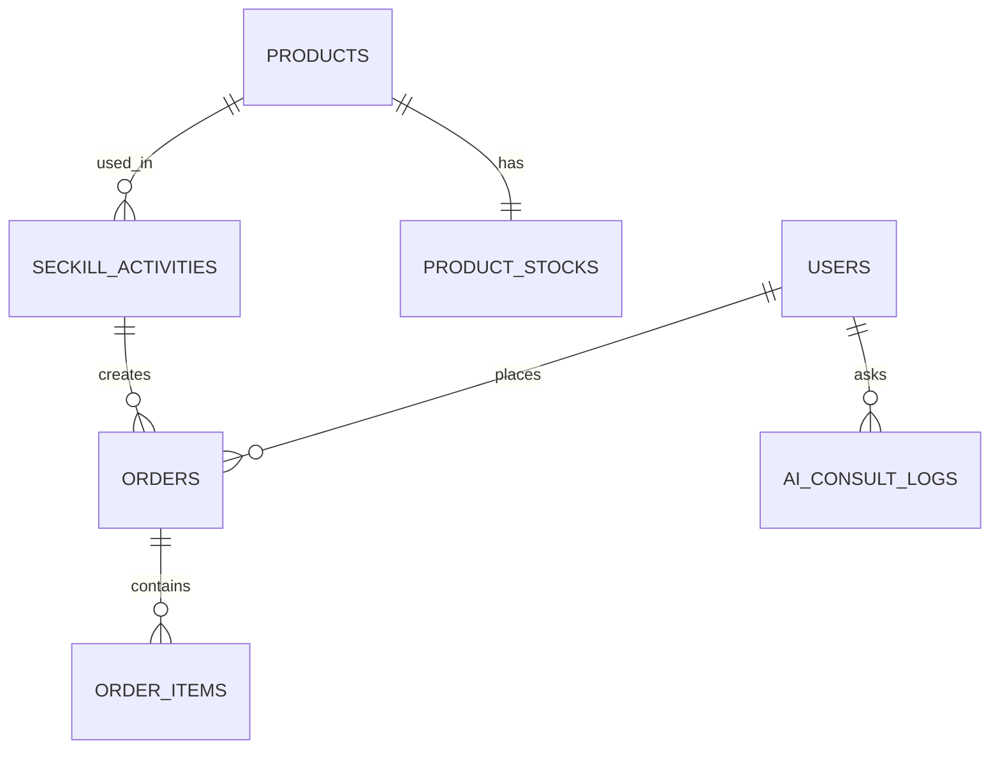

# 数据库设计

## 1. 目标

本文档冻结项目当前阶段的核心表、字段边界、主键、唯一索引、状态枚举和归属责任，作为 B 组实现秒杀/订单链路的数据库契约，也作为 C 组 AI 日志扩展的参考。

## 2. 设计原则

1. 核心业务以 MySQL 持久化。
2. 表结构先定文档，再写代码。
3. 涉及跨服务状态流转的表必须有明确状态枚举。
4. 约束优先于应用层校验，关键字段必须建立唯一索引。
5. 不同模块不得私自改动其他模块负责的字段语义。

## 3. 表归属

| 表名 | 负责人 | 说明 |
| --- | --- | --- |
| `users` | A | 用户与角色信息 |
| `products` | B | 商品基础信息 |
| `product_stocks` | B | 商品库存 |
| `seckill_activities` | B | 秒杀活动信息 |
| `orders` | B | 订单主表 |
| `order_items` | B | 订单明细表 |
| `mq_message_logs` | B | MQ 消费/投递记录，可选但推荐 |
| `ai_consult_logs` | C | AI 咨询日志，可选 |

## 4. ER 关系图



## 5. 核心表设计

### 5.1 `users`

| 字段 | 类型 | 约束 | 说明 |
| --- | --- | --- | --- |
| `id` | bigint | PK | 用户主键 |
| `username` | varchar(64) | UNIQUE, NOT NULL | 用户名 |
| `password_hash` | varchar(255) | NOT NULL | 密码哈希 |
| `phone` | varchar(20) | UNIQUE | 手机号 |
| `role` | varchar(20) | NOT NULL | `CUSTOMER` / `ADMIN` |
| `status` | varchar(20) | NOT NULL | `ACTIVE` / `DISABLED` |
| `created_at` | datetime | NOT NULL | 创建时间 |
| `updated_at` | datetime | NOT NULL | 更新时间 |

### 5.2 `products`

| 字段 | 类型 | 约束 | 说明 |
| --- | --- | --- | --- |
| `id` | bigint | PK | 商品主键 |
| `name` | varchar(128) | NOT NULL | 商品名称 |
| `description` | text | NULL | 商品描述 |
| `price` | decimal(10,2) | NOT NULL | 原价 |
| `status` | varchar(20) | NOT NULL | `ON_SALE` / `OFF_SALE` |
| `created_by` | bigint | FK -> users.id | 创建人 |
| `created_at` | datetime | NOT NULL | 创建时间 |
| `updated_at` | datetime | NOT NULL | 更新时间 |

### 5.3 `product_stocks`

| 字段 | 类型 | 约束 | 说明 |
| --- | --- | --- | --- |
| `id` | bigint | PK | 库存主键 |
| `product_id` | bigint | UNIQUE, FK -> products.id | 商品 ID |
| `total_stock` | int | NOT NULL | 总库存 |
| `available_stock` | int | NOT NULL | 可售库存 |
| `reserved_stock` | int | NOT NULL | 预留库存，可选 |
| `version` | bigint | NOT NULL | 乐观锁版本 |
| `updated_at` | datetime | NOT NULL | 更新时间 |

### 5.4 `seckill_activities`

| 字段 | 类型 | 约束 | 说明 |
| --- | --- | --- | --- |
| `id` | bigint | PK | 活动主键 |
| `product_id` | bigint | FK -> products.id | 商品 ID |
| `activity_name` | varchar(128) | NOT NULL | 活动名称 |
| `seckill_price` | decimal(10,2) | NOT NULL | 秒杀价 |
| `seckill_stock` | int | NOT NULL | 活动库存 |
| `start_time` | datetime | NOT NULL | 开始时间 |
| `end_time` | datetime | NOT NULL | 结束时间 |
| `status` | varchar(20) | NOT NULL | `DRAFT` / `READY` / `ONGOING` / `FINISHED` / `CANCELLED` |
| `created_at` | datetime | NOT NULL | 创建时间 |
| `updated_at` | datetime | NOT NULL | 更新时间 |

### 5.5 `orders`

| 字段 | 类型 | 约束 | 说明 |
| --- | --- | --- | --- |
| `id` | bigint | PK | 订单主键 |
| `order_no` | varchar(64) | UNIQUE, NOT NULL | 订单号 |
| `user_id` | bigint | FK -> users.id | 下单用户 |
| `activity_id` | bigint | FK -> seckill_activities.id | 秒杀活动 |
| `status` | varchar(20) | NOT NULL | 订单状态 |
| `total_amount` | decimal(10,2) | NOT NULL | 订单金额 |
| `created_at` | datetime | NOT NULL | 创建时间 |
| `updated_at` | datetime | NOT NULL | 更新时间 |

订单状态枚举：

```text
QUEUEING
CREATED
FAILED
CANCELLED
PAID
```

唯一约束建议：

```text
UNIQUE(user_id, activity_id)
```

用途：防止同一用户对同一活动重复下单。

### 5.6 `order_items`

| 字段 | 类型 | 约束 | 说明 |
| --- | --- | --- | --- |
| `id` | bigint | PK | 明细主键 |
| `order_id` | bigint | FK -> orders.id | 订单 ID |
| `product_id` | bigint | FK -> products.id | 商品 ID |
| `quantity` | int | NOT NULL | 数量 |
| `unit_price` | decimal(10,2) | NOT NULL | 单价 |
| `created_at` | datetime | NOT NULL | 创建时间 |

### 5.7 `mq_message_logs`

| 字段 | 类型 | 约束 | 说明 |
| --- | --- | --- | --- |
| `id` | bigint | PK | 主键 |
| `message_id` | varchar(64) | UNIQUE, NOT NULL | 消息唯一标识 |
| `event_type` | varchar(64) | NOT NULL | 事件类型 |
| `business_key` | varchar(128) | UNIQUE | 业务幂等键 |
| `status` | varchar(20) | NOT NULL | `RECEIVED` / `PROCESSED` / `FAILED` |
| `retry_count` | int | NOT NULL | 重试次数 |
| `payload` | json/text | NOT NULL | 原始消息内容 |
| `created_at` | datetime | NOT NULL | 创建时间 |
| `updated_at` | datetime | NOT NULL | 更新时间 |

### 5.8 `ai_consult_logs`

| 字段 | 类型 | 约束 | 说明 |
| --- | --- | --- | --- |
| `id` | bigint | PK | 主键 |
| `user_id` | bigint | FK -> users.id | 用户 ID |
| `product_id` | bigint | FK -> products.id | 商品 ID |
| `question` | text | NOT NULL | 用户问题 |
| `answer` | text | NOT NULL | AI 回复 |
| `cache_hit` | tinyint | NOT NULL | 是否命中缓存 |
| `status` | varchar(20) | NOT NULL | `SUCCESS` / `FALLBACK` / `FAILED` |
| `created_at` | datetime | NOT NULL | 创建时间 |

## 6. 状态枚举总表

### 6.1 用户状态

```text
ACTIVE
DISABLED
```

### 6.2 商品状态

```text
ON_SALE
OFF_SALE
```

### 6.3 秒杀活动状态

```text
DRAFT
READY
ONGOING
FINISHED
CANCELLED
```

### 6.4 订单状态

```text
QUEUEING
CREATED
FAILED
CANCELLED
PAID
```

### 6.5 MQ 消息状态

```text
RECEIVED
PROCESSED
FAILED
```

### 6.6 AI 日志状态

```text
SUCCESS
FALLBACK
FAILED
```

## 7. 索引约定

必须存在的索引或约束：

1. `users.username` 唯一索引
2. `users.phone` 唯一索引
3. `products.id` 主键
4. `product_stocks.product_id` 唯一索引
5. `seckill_activities.product_id` 普通索引
6. `orders.order_no` 唯一索引
7. `orders(user_id, activity_id)` 唯一索引
8. `mq_message_logs.message_id` 唯一索引
9. `mq_message_logs.business_key` 唯一索引或复合唯一约束

## 8. 变更控制

以下内容变更前必须先改本文档：

1. 新增或删除表
2. 字段类型修改
3. 主键修改
4. 唯一索引修改
5. 状态枚举修改
6. 外键关系修改

