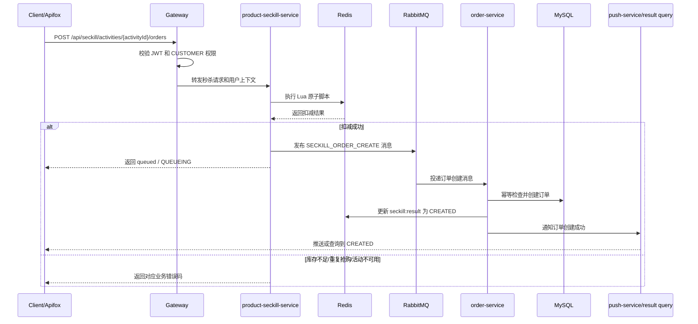

# 秒杀订单核心链路与生产演进设计

## 1. 文档目标

本文档是成员 B 负责的项目级核心架构设计文档，用于指导后续代码实现、Apifox 联调、演示视频和最终报告撰写。

本文档重点回答三个问题：

1. 本地原型中，如何用 Redis + MQ 保证秒杀不超卖、订单异步落库。
2. 异常场景下，如何保证系统状态可解释、可恢复、可演示。
3. 如果系统进入百万日活的正式生产环境，如何从本地原型演进为高可用、高并发架构。

本文档必须遵守以下上位文档：

| 文档 | 约束内容 |
| --- | --- |
| `docs/API接口契约.md` | 接口路径、请求字段、响应字段、权限 |
| `docs/统一响应格式与错误码.md` | 统一返回结构和错误码 |
| `docs/认证与权限规范.md` | JWT、角色、权限边界 |
| `docs/数据库设计.md` | 表结构、索引、状态枚举 |
| `docs/Redis-Key设计.md` | Redis key 命名和语义 |
| `docs/MQ消息契约.md` | RabbitMQ 拓扑、消息体、幂等字段 |
| `docs/生产环境演进方案.md` | 生产环境演进总方向 |

## 2. 初学者版核心解释

普通下单可以理解为：

```text
用户点购买 -> 查数据库库存 -> 数据库减库存 -> 创建订单 -> 返回成功
```

秒杀不能这样做。因为 100 件商品可能同时有 10000 个用户抢，如果所有请求都直接访问数据库，会出现两个问题：

1. 数据库压力过大，接口变慢甚至崩溃。
2. 多个请求同时扣库存，可能卖出超过 100 件，也就是超卖。

因此本项目把秒杀拆成两个阶段：

```text
第一阶段：抢资格
第二阶段：慢慢创建订单
```

对应到系统设计：

| 组件 | 通俗理解 | 本项目职责 |
| --- | --- | --- |
| Gateway | 门卫 | 检查用户是否登录，统一转发请求 |
| Redis | 高速计数器 | 保存秒杀库存，快速判断谁抢到资格 |
| Lua 脚本 | 不可插队的裁判 | 一次性完成检查库存、扣库存、标记用户 |
| RabbitMQ | 排队叫号系统 | 把抢到资格的请求排队交给订单服务 |
| order-service | 后台出票员 | 从队列取消息，真正创建订单 |
| MySQL | 正式账本 | 保存商品、活动、订单等最终数据 |
| Push/SSE | 通知器 | 订单创建成功后通知用户 |

一句话概括：

```text
Redis 负责抢名额，RabbitMQ 负责排队，订单服务负责落库，MySQL 保存最终事实。
```

## 3. 设计目标与非目标

### 3.1 设计目标

1. 100 件库存、10000 并发请求下不超卖。
2. 秒杀接口不直接扣数据库库存。
3. 秒杀成功后立即返回 `queued`，不等待订单落库。
4. 订单创建通过 RabbitMQ 异步完成。
5. 订单消费必须幂等，重复消息不能创建重复订单。
6. 用户可以查询秒杀结果。
7. 订单创建成功后可以衔接 C 负责的 SSE/WebSocket 推送。
8. 文档能支撑最终报告中的技术选型依据和生产环境演进方案。

### 3.2 非目标

1. 不实现完整支付闭环。
2. 不实现复杂营销活动系统。
3. 不实现真实公有云集群部署。
4. 不在秒杀接口中同步等待订单创建成功。
5. 不绕过 Gateway 设计新的客户端入口。

## 4. 本地原型核心链路

本地原型链路固定为：

```text
Client
 -> Gateway
 -> product-seckill-service
 -> Redis Lua 原子扣减
 -> RabbitMQ
 -> order-service
 -> MySQL
 -> Redis 秒杀结果更新
 -> Push/SSE 或结果查询
```

### 4.1 时序图



### 4.2 状态流转

秒杀接口返回时，订单还没有真正创建。

```text
Redis 扣减成功 -> QUEUEING
MQ 消费成功 -> CREATED
MQ 投递失败或订单落库失败 -> FAILED
```

订单状态枚举遵守 `docs/数据库设计.md`：

```text
QUEUEING
CREATED
FAILED
CANCELLED
PAID
```

本项目演示重点使用：

| 状态 | 含义 |
| --- | --- |
| `QUEUEING` | 用户抢到资格，正在排队创建订单 |
| `CREATED` | 订单已经写入 MySQL |
| `FAILED` | 抢购或订单创建失败 |

## 5. 接口边界

成员 B 负责实现或支撑以下接口，但不得私自修改路径、请求字段、响应字段和权限。

| 接口 | 权限 | 职责 |
| --- | --- | --- |
| `POST /api/products` | `ADMIN` | 创建商品 |
| `GET /api/products` | `PUBLIC` | 商品分页查询 |
| `GET /api/products/{productId}` | `PUBLIC` | 商品详情，供列表、AI 上下文使用 |
| `PUT /api/products/{productId}/stock` | `ADMIN` | 设置商品库存 |
| `POST /api/seckill/activities` | `ADMIN` | 创建秒杀活动并触发库存预热 |
| `GET /api/seckill/activities/{activityId}` | `PUBLIC` | 秒杀活动详情 |
| `POST /api/seckill/activities/{activityId}/orders` | `CUSTOMER` | 发起秒杀，返回排队中 |
| `GET /api/seckill/activities/{activityId}/result` | `CUSTOMER` | 查询秒杀结果 |
| `GET /api/orders` | `CUSTOMER` | 查询个人订单 |
| `GET /api/orders/{orderId}` | `CUSTOMER` | 查询订单详情 |
| `GET /api/orders/admin` | `ADMIN` | 管理员查询订单 |

### 5.1 活动名称处理

当前 `docs/API接口契约.md` 的创建秒杀活动请求体未包含 `activityName`，但 `docs/数据库设计.md` 中 `seckill_activities.activity_name` 为必填。

为不破坏现有 API 契约，本地原型采用以下默认规则：

```text
activity_name = "秒杀活动-" + productId
```

如果后续需要由前端传入活动名称，必须先由成员 A 修改 `docs/API接口契约.md`。

### 5.2 用户上下文

秒杀接口需要 `userId`。成员 B 不负责解析 JWT，默认由 Gateway 完成认证并传递用户上下文。

服务实现时应遵守：

1. `product-seckill-service` 和 `order-service` 不自行定义新的认证规则。
2. 用户上下文来源以成员 A 的 Gateway 和认证规范为准。
3. 本文档只要求业务层最终能拿到 `userId`、`role`。

## 6. 数据库设计落地

数据库是最终事实来源，Redis 和 MQ 用于处理高并发和异步削峰。

### 6.1 成员 B 负责表

| 表名 | 用途 | 关键约束 |
| --- | --- | --- |
| `products` | 商品基础信息 | `id` 主键 |
| `product_stocks` | 商品库存 | `product_id` 唯一 |
| `seckill_activities` | 秒杀活动 | `product_id` 普通索引 |
| `orders` | 订单主表 | `order_no` 唯一，`user_id + activity_id` 唯一 |
| `order_items` | 订单明细 | `order_id` 关联订单 |
| `mq_message_logs` | MQ 幂等和追踪 | `message_id` 唯一，`business_key` 唯一 |

### 6.2 唯一索引的作用

| 唯一索引 | 解决的问题 |
| --- | --- |
| `product_stocks.product_id` | 一个商品只能有一条库存记录 |
| `orders.order_no` | 一个订单号只能创建一笔订单 |
| `orders(user_id, activity_id)` | 同一用户同一活动不能重复下单 |
| `mq_message_logs.message_id` | 同一 MQ 消息不能重复处理 |
| `mq_message_logs.business_key` | 同一业务事件不能重复处理 |

这些约束是幂等的最后防线。即使应用层判断失误，数据库唯一索引也能阻止重复订单。

## 7. Redis 设计

Redis 负责秒杀瞬时高并发控制。

### 7.1 核心 Key

| Key | 类型 | 语义 |
| --- | --- | --- |
| `seckill:stock:{activityId}` | string/int | 秒杀活动剩余库存 |
| `seckill:user:{activityId}:{userId}` | string | 用户是否已参与该活动 |
| `seckill:result:{activityId}:{userId}` | string/hash/json | 用户秒杀结果 |
| `seckill:activity:{activityId}` | hash/json | 活动基础信息缓存 |

### 7.2 库存预热

创建秒杀活动后，`product-seckill-service` 自动完成 Redis 预热，不新增客户端接口。

预热内容：

```text
seckill:stock:{activityId} = seckillStock
seckill:activity:{activityId} = 活动基础信息
```

预热前检查：

1. 商品存在。
2. 商品状态为 `ON_SALE`。
3. 商品可售库存大于等于活动库存。
4. 活动开始时间早于结束时间。

### 7.3 Lua 原子扣减

Redis 扣减必须用 Lua 脚本一次性完成，不能拆成多次 Redis 命令。

原因：

```text
如果先查库存再扣库存，在高并发下多个请求可能同时看到库存 > 0，最终导致超卖。
Lua 脚本在 Redis 中原子执行，中间不会被其他请求插队。
```

Lua 逻辑：

```text
1. 检查活动缓存是否存在。
2. 检查活动是否已开始。
3. 检查活动是否已结束。
4. 检查用户是否已经抢过。
5. 检查库存是否大于 0。
6. 库存减 1。
7. 写入用户参与标记。
8. 写入秒杀结果 QUEUEING。
9. 返回执行结果。
```

返回码：

| Lua 返回码 | HTTP 业务结果 | 含义 |
| --- | --- | --- |
| `0` | `queued` | 扣减成功，进入订单队列 |
| `1` | `10001` | 库存不足 |
| `2` | `10004` | 用户已参与该活动 |
| `3` | `10002` | 秒杀活动未开始 |
| `4` | `10003` | 秒杀活动已结束 |
| `5` | `404` | 活动不存在 |

### 7.4 秒杀结果

秒杀成功进入队列时：

```json
{
  "status": "QUEUEING",
  "orderId": null,
  "message": "queued"
}
```

订单落库成功后：

```json
{
  "status": "CREATED",
  "orderId": 90001,
  "message": "订单创建成功"
}
```

失败时：

```json
{
  "status": "FAILED",
  "orderId": null,
  "message": "订单创建失败"
}
```

`GET /api/seckill/activities/{activityId}/result` 优先读取该结果 key。

## 8. MQ 异步下单设计

RabbitMQ 负责把瞬时流量变成可控的后台订单创建任务。

### 8.1 消息拓扑

```text
seckill.order.exchange
 -> seckill.order.create.queue
 -> order-service
```

| 名称 | 类型 | 说明 |
| --- | --- | --- |
| `seckill.order.exchange` | topic exchange | 秒杀订单事件交换机 |
| `seckill.order.create.queue` | queue | 订单创建队列 |
| `seckill.order.create.dlq` | queue | 死信队列 |
| `seckill.order.create` | routing key | 订单创建路由键 |

### 8.2 订单创建消息

消息体严格遵守 `docs/MQ消息契约.md`：

```json
{
  "messageId": "uuid",
  "eventType": "SECKILL_ORDER_CREATE",
  "activityId": 1,
  "userId": 10001,
  "productId": 20001,
  "quantity": 1,
  "seckillPrice": 99.9,
  "orderNo": "ORD202605250001",
  "createdAt": "2026-05-25T10:00:00"
}
```

### 8.3 生产者处理规则

`product-seckill-service` 是生产者。

处理顺序：

```text
Redis Lua 扣减成功
-> 构造订单创建消息
-> 投递 RabbitMQ
-> 投递成功后向用户返回 queued
```

注意：

1. MQ 投递成功不代表订单创建成功。
2. 秒杀接口不得同步调用 `order-service` 创建订单。
3. 秒杀接口不得直接写 `orders` 表。

### 8.4 本地原型 MQ 投递失败处理

本地原型采用 Redis 回滚策略。

如果 Redis 扣减成功但 MQ 投递失败：

```text
1. seckill:stock:{activityId} 加 1。
2. 删除 seckill:user:{activityId}:{userId}。
3. seckill:result:{activityId}:{userId} 写入 FAILED。
4. 接口返回 20001 MQ 投递失败。
```

这样可以避免本地演示中出现“库存少了但没有订单消息”的状态。

生产环境不建议只依赖接口线程回滚，生产方案见第 13 章。

## 9. 订单消费与落库设计

`order-service` 是消费者，负责把 MQ 消息变成 MySQL 订单。

### 9.1 消费流程

```text
收到消息
-> 记录或检查 mq_message_logs
-> 检查 messageId 是否处理过
-> 检查 orderNo 是否已存在
-> 检查 userId + activityId 是否已有订单
-> 创建 orders
-> 创建 order_items
-> 更新 mq_message_logs 为 PROCESSED
-> 更新 Redis 秒杀结果为 CREATED
-> 通知推送模块
-> ACK 消息
```

### 9.2 幂等策略

幂等是指：同一个操作执行多次，最终结果仍然只生效一次。

本项目使用三层幂等：

| 层级 | 幂等键 | 作用 |
| --- | --- | --- |
| MQ 消息层 | `messageId` | 防止同一消息重复消费 |
| 订单号层 | `orderNo` | 防止同一订单号重复落库 |
| 业务层 | `userId + activityId` | 防止同一用户同一活动重复下单 |

### 9.3 消息确认

ACK 规则：

1. 订单和明细都落库成功后，才 ACK。
2. 已确认是重复消息且已有订单时，可以 ACK。
3. 临时异常可以重试。
4. 多次失败进入死信队列。
5. 不可恢复异常写入 `mq_message_logs.status=FAILED`。

### 9.4 订单金额

秒杀订单金额使用：

```text
total_amount = seckillPrice * quantity
```

订单明细：

```text
unit_price = seckillPrice
quantity = 消息中的 quantity
```

本地原型默认 `quantity = 1`。

## 10. 异常场景处理矩阵

| 场景 | 发生位置 | 本地原型处理 | 生产演进处理 |
| --- | --- | --- | --- |
| 活动不存在 | Redis Lua | 返回 `404` | 监控异常请求比例 |
| 活动未开始 | Redis Lua | 返回 `10002` | 网关或服务层提前拦截 |
| 活动已结束 | Redis Lua | 返回 `10003` | 活动状态定时同步 |
| 库存不足 | Redis Lua | 返回 `10001` | 热点库存保护和售罄标记 |
| 用户重复抢购 | Redis Lua | 返回 `10004` | Redis 标记 + DB 唯一索引 |
| Redis 扣减成功但 MQ 失败 | 秒杀服务 | 回滚 Redis，结果置 `FAILED` | Outbox、本地消息表、补偿任务 |
| MQ 消息重复投递 | 订单服务 | 幂等检查后 ACK | 幂等表和唯一索引兜底 |
| 订单落库失败 | 订单服务 | 记录 `FAILED`，进入重试或死信 | 自动重试、死信告警、人工补偿 |
| Redis 结果更新失败 | 订单服务 | 订单以 MySQL 为准，结果可补偿刷新 | 定时任务回刷结果缓存 |
| 推送失败 | 推送模块 | 用户可通过结果查询获取状态 | 推送重试、消息重放 |

## 11. 与推送和 AI 的衔接

### 11.1 推送衔接

成员 C 负责 SSE/WebSocket 推送。成员 B 需要提供订单成功后的事件数据。

建议推送事件：

```json
{
  "eventType": "ORDER_CREATED",
  "activityId": 1,
  "orderId": 90001,
  "userId": 10001,
  "status": "CREATED",
  "message": "订单创建成功"
}
```

如果推送失败，不影响订单最终状态。用户仍可通过结果查询或订单查询看到最终结果。

### 11.2 AI 商品咨询边界

成员 B 不主写 LLM 调用链路，但需要保证商品上下文数据可用。

商品上下文建议包含：

```json
{
  "productId": 20001,
  "name": "Demo 秒杀商品",
  "description": "用于秒杀演示的商品",
  "price": 6999.00,
  "status": "ON_SALE",
  "activityId": 1,
  "seckillPrice": 99.90,
  "activityStatus": "ONGOING"
}
```

AI 问答缓存 key 使用：

```text
ai:product:qa:{productId}:{questionHash}
```

该 key 由 C 负责实现，B 只保证商品和活动数据可靠。

## 12. 100 件库存、10000 并发验证方案

### 12.1 验证目标

| 指标 | 目标 |
| --- | --- |
| 初始库存 | 100 |
| 并发请求数 | 10000 |
| 成功进入队列数 | 不超过 100 |
| 最终订单数 | 不超过 100 |
| Redis 库存 | 不为负数 |
| 重复用户订单 | 不允许出现 |

### 12.2 验证步骤

```text
1. 清理 MySQL 中旧订单和 MQ 日志。
2. 清理 Redis 中旧 seckill:* key。
3. 创建商品并设置库存为 100。
4. 创建秒杀活动，活动库存为 100。
5. 确认 Redis 已预热 seckill:stock:{activityId}=100。
6. 使用脚本模拟 10000 个秒杀请求。
7. 等待 MQ 消费完成。
8. 查询 Redis 剩余库存。
9. 查询 orders 表订单数量。
10. 查询 orders(user_id, activity_id) 是否存在重复。
```

### 12.3 验收口径

验收通过条件：

```text
Redis 剩余库存 >= 0
订单数 <= 100
成功结果数 <= 100
同一 userId + activityId 只有一笔订单
MQ 无异常消息堆积或失败原因可解释
```

如果出现以下情况，视为核心链路失败：

```text
Redis 库存为负数
订单数超过 100
同一用户同一活动出现多笔订单
秒杀接口同步等待订单落库
秒杀接口直接扣数据库库存
```

## 13. 正式生产环境演进方案

本地电脑无法真实模拟百万日活，因此生产环境演进通过文档说明。

### 13.1 总体部署演进

本地原型：

```text
单机 Gateway
单实例微服务
单机 MySQL
单机 Redis
单机 RabbitMQ
```

生产环境：

```text
负载均衡
-> Gateway 集群
-> 秒杀服务多实例
-> Redis Sentinel/Cluster
-> RabbitMQ 集群
-> 订单服务多实例
-> MySQL 主从复制/读写分离
```

### 13.2 高可用设计

| 组件 | 本地原型 | 生产改造 |
| --- | --- | --- |
| Gateway | 单实例 | 多实例 + Nginx/SLB |
| product-seckill-service | 单实例 | 多实例水平扩容 |
| order-service | 单实例 | 多实例消费者组 |
| Redis | 单机 | Sentinel 或 Cluster |
| RabbitMQ | 单机 | 集群 + 持久化队列 |
| MySQL | 单机 | 主从复制、备份恢复 |

高可用目标：

1. 任意单个服务实例宕机，不影响整体服务。
2. Redis 主节点故障后可自动切换。
3. RabbitMQ 节点故障后消息不丢失。
4. MySQL 有备份和从库支撑恢复。

### 13.3 高并发扩容策略

生产环境流量突增时，采用以下策略：

1. Gateway 层限流，先挡住明显异常流量。
2. 秒杀活动开始前预热 Redis 活动信息和库存。
3. 秒杀服务无状态化，按 CPU 和 QPS 水平扩容。
4. Redis 热点 key 保护，必要时做库存分片。
5. RabbitMQ 队列削峰，订单服务按消费积压动态扩容。
6. MySQL 只承接最终订单写入，不承接秒杀库存竞争。

### 13.4 库存分片方案

当单个 `seckill:stock:{activityId}` 成为热点 key 时，可将库存拆成多个分片：

```text
seckill:stock:{activityId}:shard:0
seckill:stock:{activityId}:shard:1
seckill:stock:{activityId}:shard:2
...
```

请求进入时按用户 ID 或随机策略选择分片扣减。

分片目标：

1. 分散单 key 压力。
2. 降低 Redis 热点风险。
3. 仍然保证所有分片库存总和不超过活动库存。

本地原型不实现库存分片，只在生产演进中说明。

### 13.5 消息可靠性演进

本地原型采用“Redis 扣减成功后投递 MQ，投递失败回滚 Redis”。

生产环境推荐升级为：

```text
Redis 扣减成功
-> 写本地消息表/Outbox
-> 异步发布 MQ
-> 发布成功标记消息已发送
-> 发布失败由补偿任务重试
```

这样做的好处：

1. 避免接口线程里处理复杂补偿。
2. 即使 MQ 短暂不可用，消息也不会直接丢失。
3. 可以通过后台任务持续重试。
4. 可以通过监控发现未发送消息积压。

### 13.6 订单一致性演进

生产环境仍采用最终一致性：

```text
Redis 中先确认抢购资格
MQ 中排队创建订单
MySQL 中保存最终订单事实
```

一致性保障：

1. Redis Lua 保证不会超卖。
2. MQ 保证订单创建异步削峰。
3. `orders(user_id, activity_id)` 唯一索引防止重复订单。
4. `mq_message_logs.message_id` 唯一索引防止重复消费。
5. 补偿任务修复 Redis 结果和 MySQL 状态不一致。

### 13.7 RabbitMQ 积压处理

如果秒杀后 RabbitMQ 出现消息积压：

1. 临时扩容 `order-service` 消费实例。
2. 检查 MySQL 写入耗时是否成为瓶颈。
3. 如果数据库瓶颈明显，限制订单服务消费速率，保护数据库。
4. 对失败消息进入死信队列。
5. 对死信队列配置告警和人工处理流程。

### 13.8 MySQL 演进

生产环境 MySQL 应升级为：

1. 主从复制。
2. 读写分离。
3. 定期备份。
4. 慢 SQL 监控。
5. 订单表按时间或订单号分区/分表的预留设计。

订单写入必须走主库；订单查询可以走从库。

### 13.9 AI 调用生产级优化

AI 咨询不是秒杀主链路，但会影响用户体验和系统成本。

生产环境中：

1. 商品详情和活动信息由 B 负责提供稳定上下文。
2. 热门商品的常见问题可以缓存。
3. 相似问题可复用历史回答。
4. LLM 调用需要用户级限流。
5. LLM 超时或失败时返回降级建议。
6. AI 请求不应影响秒杀扣库存和订单创建主链路。

## 14. 技术选型依据

### 14.1 为什么用 Redis

Redis 读写速度快，适合保存秒杀库存这种高频变化的热点数据。

本项目使用 Redis 的原因：

1. 避免 10000 个请求直接竞争数据库库存行。
2. Lua 脚本可以保证扣减原子性。
3. 可以快速记录用户是否已参与活动。
4. 可以直接支持秒杀结果查询。

### 14.2 为什么用 RabbitMQ

RabbitMQ 适合本项目的异步订单削峰。

本项目使用 RabbitMQ 的原因：

1. 秒杀接口可以快速返回 `queued`。
2. 订单服务可以按能力慢慢消费。
3. 消息可以持久化。
4. 支持 ACK、重试、死信队列。
5. 本地演示比更重的流式系统更直观。

### 14.3 为什么用 MySQL

MySQL 负责保存最终事实。

Redis 里的状态是高并发过程数据，MQ 里的消息是异步任务，最终订单必须落到 MySQL。

## 15. 与成员 A/C 的对接边界

### 15.1 与成员 A 对接

成员 A 负责：

1. Gateway 路由。
2. JWT 校验。
3. 权限裁定。
4. 全局接口契约。
5. 最终联调。

成员 B 需要向 A 同步：

1. 是否需要新增错误码。
2. 是否需要修改接口字段。
3. 是否需要 Gateway 传递新的用户上下文字段。
4. 是否需要新增内部管理接口。

### 15.2 与成员 C 对接

成员 C 负责：

1. SSE/WebSocket 推送。
2. 简单测试页面。
3. Apifox 集合。
4. LLM 咨询接口和前端体验。

成员 B 需要向 C 提供：

1. 商品详情字段。
2. 活动详情字段。
3. 秒杀接口 `queued` 返回样例。
4. 结果查询返回样例。
5. 订单创建成功事件字段。
6. 演示用商品、库存、活动和订单数据。

## 16. 实现 TODO

该 TODO 用于从本文档过渡到代码实现。个人进度记录仍写入 `docs/docs-B/`。

```text
[ ] 完成商品、库存、秒杀活动真实接口
[ ] 创建活动时自动预热 Redis 库存和活动信息
[ ] 实现 Redis Lua 原子扣减
[ ] 秒杀成功后构造订单创建消息
[ ] 投递 RabbitMQ 并返回 queued
[ ] MQ 投递失败时回滚 Redis
[ ] order-service 幂等消费订单消息
[ ] orders 和 order_items 落库
[ ] mq_message_logs 记录消费状态
[ ] 订单成功后更新 Redis 结果为 CREATED
[ ] 查询秒杀结果接口读取 Redis 结果
[ ] 准备 100 件库存、10000 并发验证脚本
[ ] 准备演示前数据清理和恢复步骤
```

## 17. 报告可复用内容

最终报告中，成员 B 可以直接复用本文档的以下章节：

| 报告章节 | 可复用本文档内容 |
| --- | --- |
| 本地原型架构图与数据流 | 第 4 章 |
| 核心流程时序图 | 第 4.1 节 |
| 数据库 ER 与索引说明 | 第 6 章 |
| Redis 技术选型依据 | 第 7 章、第 14.1 节 |
| MQ 技术选型依据 | 第 8 章、第 14.2 节 |
| 异常补偿设计 | 第 10 章 |
| 正式生产环境演进方案 | 第 13 章 |
| 高并发压测与验证 | 第 12 章 |
